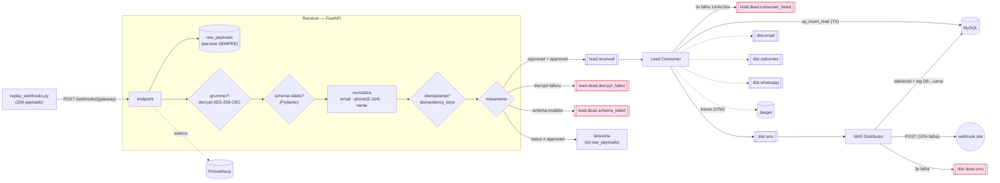
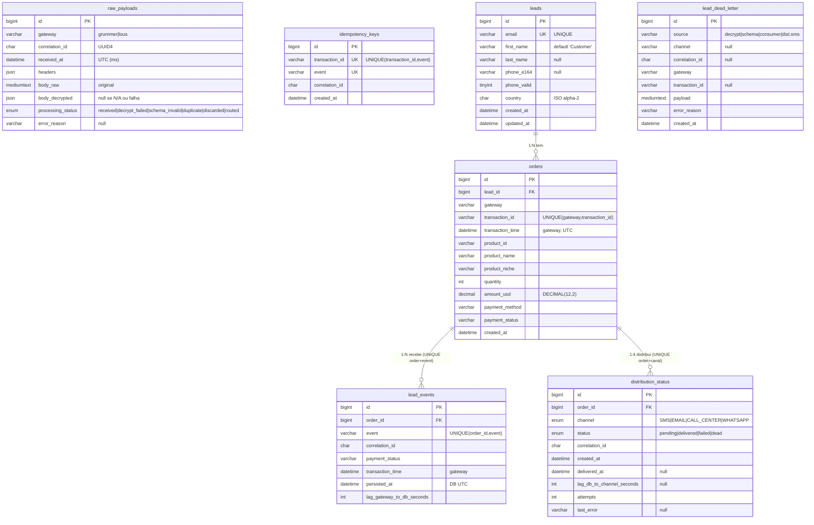
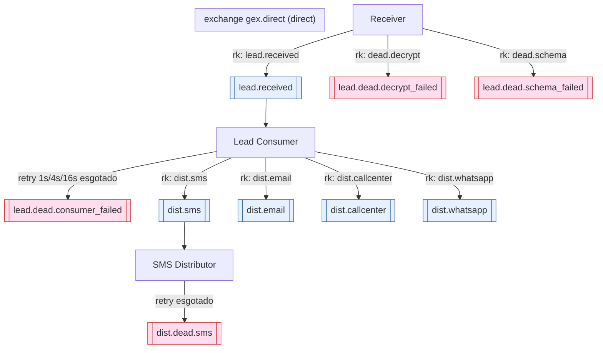
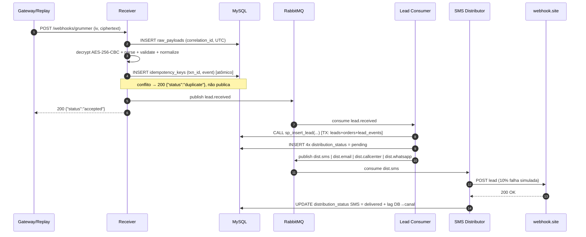
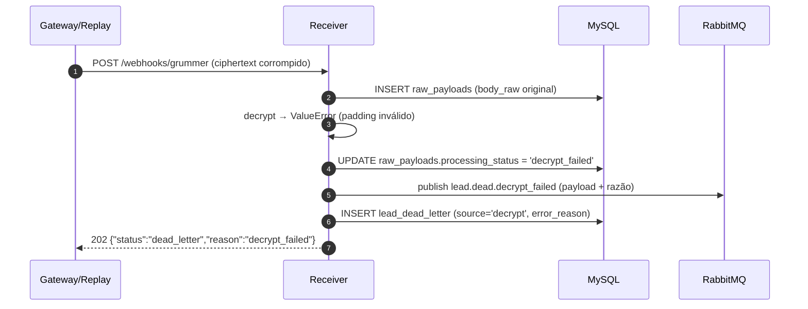
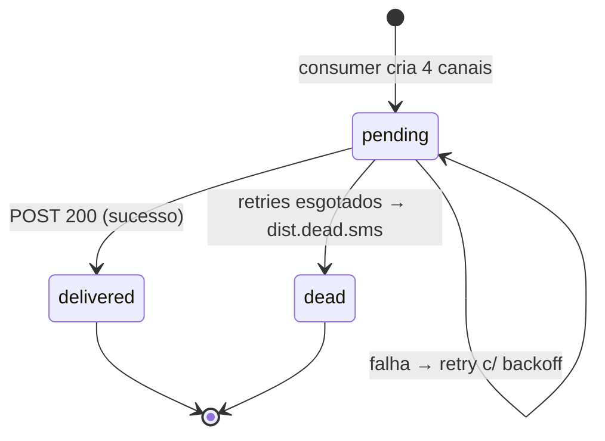

# GEX — Esteira de Integração de Webhooks

Backend que recebe webhooks de gateways de pagamento, decripta (quando preciso), valida, persiste,
publica em filas (RabbitMQ) e distribui leads para canais de marketing. Construído em **Python 3.12 +
FastAPI**, **MySQL 8** (SQL puro), **RabbitMQ**, orquestração via **docker-compose**.

---

# Gravação **https://www.loom.com/share/b66516f8ad734242bd10f6f21a07509f**

## 1. Arquitetura (visão de componentes)



Canais `email`, `callcenter` e `whatsapp` (linhas tracejadas) têm a fila e a linha em
`distribution_status` criadas, mas só o **SMS** é distribuído de fato (escopo do teste).

---

## 2. Modelo de dados (MER / schema físico)

7 tabelas: as 6 mínimas do enunciado + `idempotency_keys` (gate de idempotência do receiver).



`idempotency_keys`, `raw_payloads` e `lead_dead_letter` são tabelas de auditoria/controle, sem FK
(propositalmente: precisam sobreviver mesmo quando o payload nunca virou um `order`). DDL completa em
[`sql/001_create_tables.sql`](./sql/001_create_tables.sql); índices em
[`sql/002_indexes.sql`](./sql/002_indexes.sql).

---

## 3. Topologia RabbitMQ



---

## 4. Sequência — lead end-to-end (happy path)



---

## 5. Sequência — caminho de falha (DLQ)



---

## 6. Ciclo de vida do `distribution_status`



---

## Como rodar

Pré-requisitos: **Docker** + **docker compose**. Não precisa instalar Python/MySQL na máquina.

> A chave AES (`grummer_secret.txt`) **não está versionada** (secret não vai pro repo). Coloque o
> arquivo fornecido no teste em `docs/grummer_secret.txt` antes de subir.

```bash
# 1. sobe TUDO (MySQL + RabbitMQ + receiver + 2 workers + painéis), sem passo manual
docker compose up -d --build

# 2. injeta os 200 webhooks de exemplo no receiver
#    (precisa de Python + httpx; use uv ou um venv)
uv run python replay_webhooks.py        # ou: RECEIVER_URL=http://localhost:8000 python replay_webhooks.py
```

Painéis para inspecionar:

| Painel | URL | Credenciais |
|---|---|---|
| Adminer (banco) | http://localhost:8080 | servidor `mysql`, user `root`, senha `root`, base `gex` |
| RabbitMQ (filas) | http://localhost:15672 | `guest` / `guest` |
| Receiver (health) | http://localhost:8000/health | — |

> **SMS / webhook.site:** a URL de validação usada na entrega é
> `https://webhook.site/c1788114-8b5d-4fe3-9aaa-d58eb74e2306` (125 entregas ao vivo lá durante a
> validação). Para reproduzir, suba a stack com:
> `SMS_WEBHOOK_URL="https://webhook.site/c1788114-8b5d-4fe3-9aaa-d58eb74e2306" docker compose up -d`.
> Sem essa variável, o distribuidor cai num `sink` local (httpbin) e funciona offline.

## Rodando os testes

```bash
uv sync                 # cria o venv e instala deps (inclui dev)
uv run pytest -q        # 74 testes; integração sobe MySQL/RabbitMQ efêmeros (testcontainers)
```

## Estrutura

```
app/
├── domain/        # lógica pura, testável sem infra (crypto, schema, normalize, routing, pipeline)
├── adapters/      # I/O: db.py (aiomysql), broker.py (aio-pika)
├── receiver/      # FastAPI: app.py (handle_webhook) + main.py (entrypoint uvicorn)
├── workers/       # consumer.py + distributor.py
├── config.py      # settings via env
└── logging.py     # logs JSON + anonimização de PII
sql/               # 001_create_tables, 002_indexes, 003_stored_procs, audit_queries
tests/             # pirâmide: unit (puro) → integração (testcontainers) → e2e (receiver)
docs/              # conceitual_a, conceitual_b, explicativo, db_evidence, defesa
replay_webhooks.py # injeta os 200 webhooks
```

## Reconciliação esperada (gabarito)
| Resultado | Esperado | Obtido |
|---|---|---|
| Total de payloads | 200 | 200 |
| Válidos `approved` únicos em `lead_events` | 125 (±2) | **125** |
| DLQ `decrypt_failed` | ≥ 15 | 15 |
| DLQ `schema_failed` | ≥ 20 | 20 |
| Duplicados pela chave natural (barrados na idempotência) | ≥ 20 | 20 |
| Não-`approved` descartados | 20 | 20 |

Evidência completa do banco: [docs/db_evidence.md](docs/db_evidence.md).

## Documentação

- [docs/explicativo.md](docs/explicativo.md) — visão geral, decisões, premissas, índices, libs
- [docs/conceitual_a.md](docs/conceitual_a.md) — resolução de incidente
- [docs/conceitual_b.md](docs/conceitual_b.md) — decisões de arquitetura (trade-offs)

