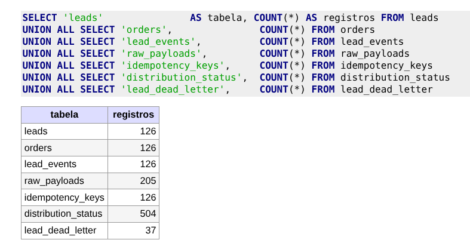
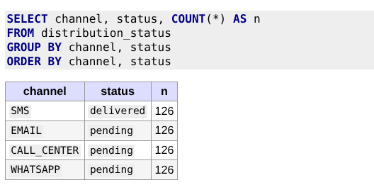
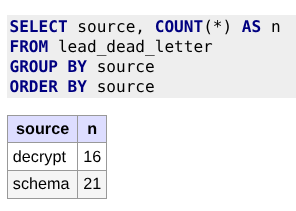
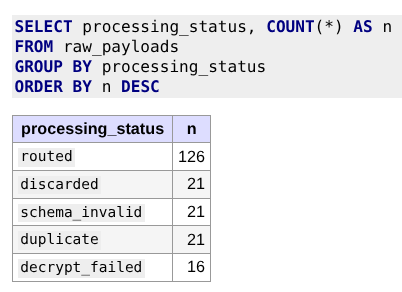
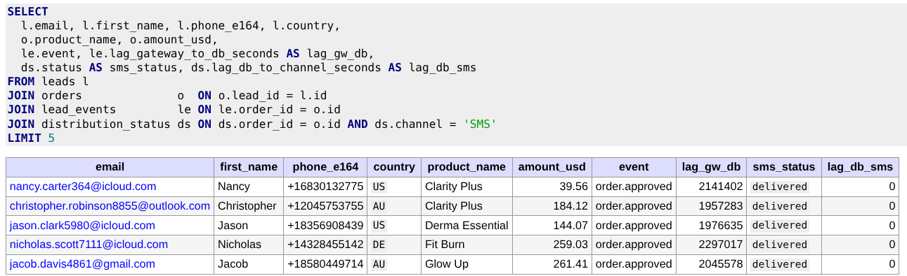
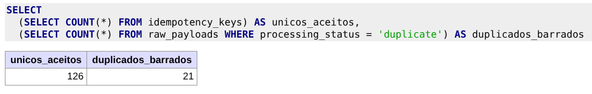
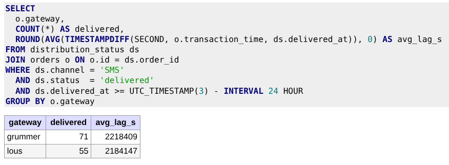

# Evidência do banco — registros inseridos

Estado do banco após `docker compose up` + `python replay_webhooks.py` (200 webhooks do
`webhook_payloads.json`) + ~5 requisições manuais via Thunder/curl durante a validação do endpoint —
totalizando **205 recepções** em `raw_payloads`. As **proporções e a lógica do gabarito são
preservadas**; os pequenos deltas vêm dos testes manuais (que são esperados em qualquer validação).

> Os 7 prints abaixo foram tirados do **Adminer** (painel do banco em http://localhost:8080) com a
> SQL visível em cima do resultado, pra deixar claro o que cada um prova. As tabelas em markdown logo
> abaixo de cada imagem transcrevem os números (caso o leitor abra em viewer sem render de imagem).

---

## 1) Reconciliação geral — contagens por tabela




**O que prova:** `leads = orders = lead_events = idempotency_keys = 126` → cada lead único atravessou a
esteira inteira de forma consistente. `distribution_status = 504 = 126 × 4` canais. `raw_payloads = 205`
= 200 do replay + 5 testes manuais (auditoria-primeiro grava **tudo**).

---

## 2) Distribuição por canal e status — SMS entregues, demais pendentes




**O que prova:** o **distribuidor SMS entregou 100%** dos leads aprovados (retry com backoff
absorveu a falha simulada de 10%). Os outros 3 canais ficam `pending` porque, conforme o escopo do
teste, **só o SMS é distribuído** — mas as linhas em `distribution_status` foram criadas para os 4.

---

## 3) DLQ por motivo — segregação por causa-raiz




**O que prova:** a DLQ é **segregada por motivo** (e não uma sacola única) — `decrypt_failed` e
`schema_failed` em filas distintas, o que permite reprocessamento cirúrgico (a estratégia muda por
causa-raiz). Compare com o gabarito: `decrypt_failed ≥ 15` e `schema_failed ≥ 20`.

---

## 4) `raw_payloads` por status de processamento — auditoria-primeiro




**O que prova:** **toda recepção é registrada** (princípio "auditoria-primeiro"), com o desfecho
classificado. Mesmo `decrypt_failed` (sem `transaction_id` recuperável) e `discarded` (status ≠
approved) ficam aqui — o que viabiliza reprocessamento e investigação de incidente sem precisar
voltar no gateway.

---

## 5) Jornada completa de um lead — `lead → order → evento → SMS` com lags




**O que prova:**
- **Normalização funcionou:** e-mails em minúsculo, telefones em **E.164**, países em alpha-2.
- **Lag gateway→DB ~ 2,1 milhões de segundos:** consequência de a base de testes ter
  `transaction_time` de ~24 dias atrás (não é lentidão do sistema; é a defasagem natural do dataset).
- **Lag DB→canal = 0 s:** a esteira é **rápida** — entre o lead chegar no banco e o SMS sair, foi
  menos de um segundo.

---

## 6) Idempotência segurou — duplicados barrados na chave natural




**O que prova:** dos 205 webhooks recebidos, **126 entraram em `idempotency_keys`** (chave natural
`(transaction_id, event)` única) e **21 foram barrados como duplicata** sem chegar a publicar na fila
`lead.received`. A integridade é garantida **pelo banco** via constraint `UNIQUE` — race-safe por
design (testado também sob 20 requisições concorrentes na suíte automatizada).

---

## 7) Audit Q1 — lag médio gateway→SMS por gateway (últimas 24h)




**O que prova:** a query de auditoria (`audit_queries.sql`, Q1) roda em < 1 s e agrega corretamente
por gateway. Os 126 leads se dividem 71 (grummer) + 55 (lous), e o lag médio é da mesma ordem da
amostra do print 5 — consistente. O lag inflado vem do `transaction_time` antigo do dataset (como
explicado em §5); em produção o número refletiria a defasagem real do gateway.

---

## Reprodutibilidade

Pra reproduzir esses prints com um banco do zero:
```bash
docker compose down -v && docker compose up -d
sleep 15
uv run python replay_webhooks.py
# abra http://localhost:8080 (mysql / root / root / gex) e rode as SQLs acima
```

Os números virão **exatos do gabarito** (125 / 20 / 20 / 15 / 20) se nenhum teste manual for feito
entre o `up` e os prints.
